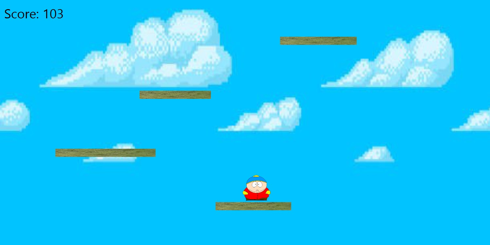

# Ice Tower Game

Welcome to the **Ice Tower Game**! This is a 2D platformer built in Java using JavaFX, where players can select different characters and navigate through a world of platforms. Players jump between platforms to reach as high as possible without falling.

## Table of Contents
- [Features](#features)
- [Installation](#installation)
- [How to Play](#how-to-play)
- [Screenshots](#screenshots)
- [Future Enhancements](#future-enhancements)
- [Contributing](#contributing)
- [License](#license)

---

## Features
- **Character Selection**: Choose between multiple characters with unique speeds (e.g., Pikachu and Bert).
- **Infinite Platforms**: Platforms disappear after 10 seconds (for start), and new ones appear randomly.
- **Game Over and Restart**: When the player falls off the screen, the game ends, and you can restart by pressing `R`.
- **Score Tracking**: The game tracks your score based on how high you've climbed.
- **Dynamic Difficulty**: As you climb higher, platforms become harder to reach and disappear sooner.

---

## Installation
### Prerequisites
- Java 8 or higher installed.
- JavaFX SDK set up (required for JavaFX projects).

### Steps
1. Clone the repository:
   ```bash
   git clone https://github.com/yourusername/ice-tower-game.git
   cd ice-tower-game

2. Compile and run the project:
    * Open the project in your favorite IDE (such as IntelliJ IDEA or Eclipse).
    * Ensure that JavaFX is configured correctly in your IDE.
    * Run the IceTowerGame class to start the game.

## How to Play
- **Select Your Character**: Upon starting the game, you will see a welcome screen where you can choose between characters.
- **Jump Between Platforms**: Use the keyboard controls to jump between platforms.
  - **Move Left/Right**: Use the left and right arrow keys.
  - **Jump**: Use the spacebar to jump.
- **Don't Fall**: The goal is to jump between platforms without falling off the screen. Platforms will disappear after 10 seconds, so plan your jumps carefully!
- **Restart**: When the game ends, press `R` to restart and try again.

## Screenshots
<p align="center">
  
  
</p>

<p align="center">
  
  
</p>


## Future Enhancements
Some ideas for future updates:
- Add new types of platforms (e.g., moving platforms, disappearing platforms).
- Introduce obstacles or enemies.
- Implement a high-score system that saves between sessions.
- Add sound effects and background music.

## Contributing
Contributions are welcome! Please follow these steps to contribute to this project:
1. Fork the repository.
2. Create a new branch for your feature or bug fix.
3. Commit your changes and push to your branch.
4. Create a pull request.

## License
This project is licensed under the MIT License - see the [LICENSE](LICENSE) file for details.

